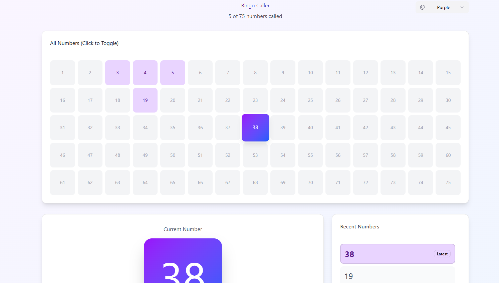

# what is this? 
A web application that keeps track of the numbers rolled during a Bingo game. Intended to be projected on a big screen .

# Features
- Shows all the numbers of the Bingo game (by default 1-75)
- Shows the numbers that have been called out (by clicking on them or rolling a new one randomly)
   - the most recent one is highlighted with a special color

# Tech stack:
- .NET 8.0 (LTS) 
- Blazor Web Assembly
- CSS library: [MudBlazor](https://mudblazor.com/)

# Initial Frontend mockup
